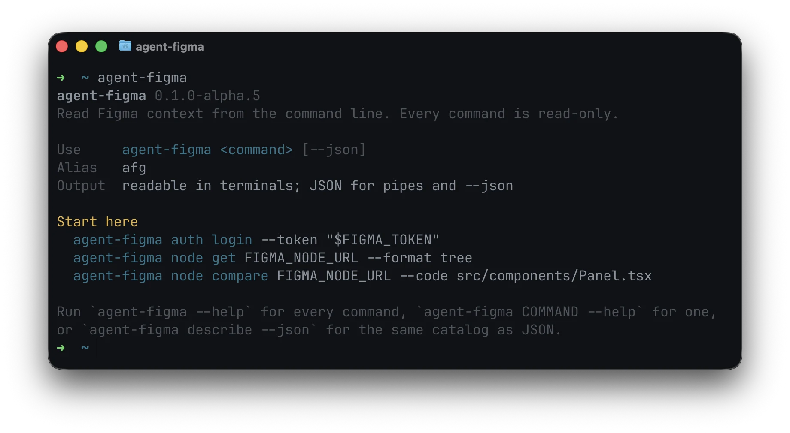

<div align="center">

# agent-figma

Read your Figma files from the command line: files, nodes, comments, versions, rendered images,
components, and styles. Built so your AI agents can read Figma too. Short alias: `afg`.

<pre align="center">npm install -g @eliya-oss/agent-figma</pre>

<p align="center"><a href="docs/installation.md">Other ways to install</a></p>



</div>

## Usage

You run two commands, once:

```bash
agent-figma auth login --token "$FIGMA_TOKEN"
npx skills add Newbie012/agent-figma --skill agent-figma
```

Then you ask your agent, and it runs the rest:

> Build the spend panel from this Figma link: `https://www.figma.com/design/…?node-id=67307-140172`

```bash
agent-figma describe --json
agent-figma node get FIGMA_NODE_URL --json
agent-figma node compare FIGMA_NODE_URL --code src/components/Panel.tsx --json
agent-figma file comments list FIGMA_URL --format ndjson
```

`describe` is the whole command catalog, so nothing has to be learned from prose. Every command
answers one compact JSON line on stdout; failures go to stderr as `{"ok":false,"error":{…}}` with a
type, a suggestion, and an exit code. Non-TTY stdout defaults to JSON, so a piped command needs no
flag.

## Looking around yourself

The CLI reads its own surface back to you, so there is nothing to memorise:

```bash
agent-figma --help                # every command, grouped by what it is for
agent-figma node get --help       # one command: usage, flags, endpoint, scopes
agent-figma node get URL --format tree
agent-figma upgrade               # upgrades, using whatever installed it
```

`--format tree` and `node compare` are the two outputs made for a person rather than a parser: a
frame as one line per node, and what the design asks for that your code never mentions.

## Notes

Every command is read-only: only GET requests, and `api call` resolves through a bundled GET-only
catalog. It returns only what the active token, its scopes, sharing, plan and seat allow.

Browser OAuth is supported and needs a relay you deploy yourself:
[Authentication](./docs/authentication.md).

An alpha: every version is named one, `0.1.0-alpha.3` and counting, and `latest` is whichever is
newest. Docs are in [`docs/`](./docs/README.md), project contracts in `.agents/`.

## License

MIT

## Sponsors

<p align="center">
	<a href="https://github.com/sponsors/Newbie012">
		
	</a>
</p>
